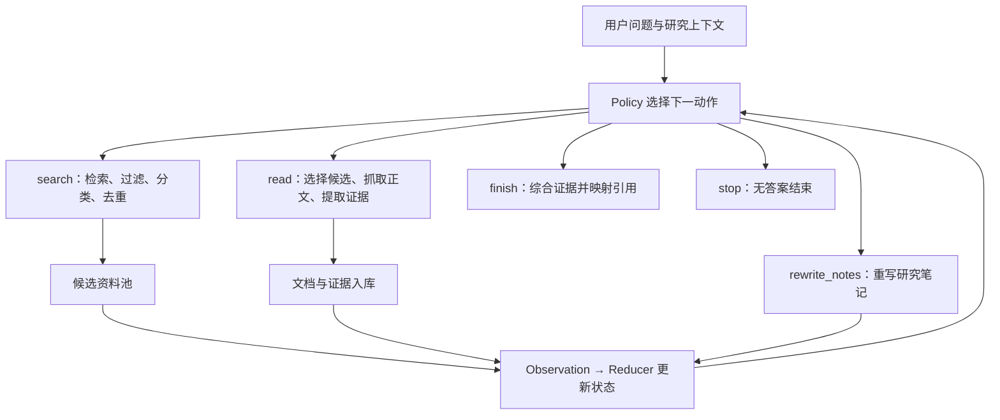

# BansoAgain 原实现梳理

梳理日期：2026-10-02。依据：`../../bansoagain` 的 `f77d660`，当时工作区无改动。范围为新闻研究主流程；本地语料库仅说明接入边界。本次阅读源码与相关测试断言，没有运行测试或调用在线服务。

## 1. 入口与职责

正常入口是 `main.py`：读取问题及可选的 `language`、`region`、`time_range`，通过 `apps/real_news.py` 组装依赖，再运行 `AgentRuntime`。

| 组件 | 实际职责 |
| --- | --- |
| `agent/runtime.py` | 循环调用 policy → executor → reducer，检查 action/observation 类型匹配，记录 trace；直到 done 或步数耗尽 |
| `agent/policies/llm_news_policy.py` | 根据当前研究上下文选择一个动作，解析并校验 LLM 返回的 JSON |
| `agent/executors/news_executor.py` | 分派搜索、阅读、笔记重写、综合、停止；依赖通过构造参数注入 |
| `agent/reducer.py` | 复制旧状态，依据 observation 更新索引、处理状态、笔记、答案及历史，并增加步数 |
| `agent/research_context.py` | 从状态和 artifact 构建供模型决策的视图，不直接把全部运行对象交给模型 |
| `artifacts/store.py` | 保存 SearchResult、Document、DocumentEvidence 的隔离副本；默认是内存存储 |

默认 `search_read` policy 将搜索与阅读分开。`atomic` 是可配置的备用路径，将搜索、LLM 选材、抓取、提取组合为一次 `research`；不是默认流程，也不是另一套底层采集实现。

## 2. 默认流程

- **搜索**：Tavily 返回标题、URL、snippet，不要求 provider 生成答案或返回正文。过滤器处理空标题、非法 URL、URL 重复与数量限制；来源分类器补充来源类型，不负责淘汰不可信来源。跨轮搜索按规范化 URL 复用已有候选。
- **选读**：policy 使用 `C1` 等候选引用选择资料，可以连续搜索后跨查询集中阅读。参数只允许尚未读取且没有终止抓取失败的候选，数量受限。默认路径不额外调用独立 selector；独立 LLM selector 用于 atomic 路径。
- **阅读**：默认 HTTP fetcher 抓取并解析 HTML/PDF，可替换为 Jina。按最终文档 URL 去重，复用已存文档。正文提取针对原始用户问题，不是当前搜索词。
- **提取**：LLM 只依据正文生成与问题有关的证据摘要，要求保留日期、数量、否定、范围、例外和不确定性；无相关内容返回空值，不生成 evidence artifact。证据是文档级文本摘要，不是逐条 claim 或原文定位记录。
- **笔记**：显式执行 `rewrite_notes` 时才调用 LLM，使用旧笔记、查询历史及完整证据替换整份笔记。用于记录覆盖情况、冲突和待解决问题；不是每轮自动追加，也不是独立事实来源。
- **综合**：`finish` 将所有已提取证据及文档元数据、笔记、问题、语言和时间上下文交给 synthesizer；不传候选 snippet、检索历史或完整正文。默认组装将决策/选材/笔记与提取连接到 `VLLM_*`，综合连接到 `EXTERNAL_LLM_*`；两者都可以是本地或远程兼容服务。

## 3. 状态与上下文

`AgentState` 保存用户问题、固定的 UTC `reference_time`、预算、动作历史、候选/文档处理状态、URL 索引、笔记、最终答案和引用。大块资料单独存在 artifact store，通过 ID 关联：

`SearchResult → Document → DocumentEvidence`

决策视图分为 `retrieval_context`（查询历史、未读候选）和 `evidence_context`（笔记、证据）。`Q1`、`C1`、`D1` 分别表示本次运行的查询、候选和文档引用；综合阶段另行生成 `S1` 等来源组引用，不能混用。

policy 默认只看到每份证据前 3,000 字符及截断标记；笔记重写和综合接收完整证据文本。提取器按 UTF-8 字节拆分正文，默认每次输入预算 24,000 字节（含提示词），每篇最多 20 块；超出块数限制报错，不静默截去尾部。原实现没有因此获得全局上下文长度保证。

## 4. 硬约束、提示词要求与现有局限

| 关注点 | 代码已落实 | 依赖模型或尚未覆盖 |
| --- | --- | --- |
| 证据边界 | 搜索与正文证据分开存储；综合只组装有 evidence 的文档 | 摘要是否忠实、结论是否被证据支持，没有语义校验器 |
| 时间 | 保存 reference_time/time_range；Tavily 接收 time_range；HTML 解析尝试提取发布日期 | 无统一事件时间模型或本地硬性日期过滤；区分发布日期与事件日期是综合提示词要求；抽取请求没有单独传入 reference_time/time_range |
| 来源 | 按域名注册表优先、provider 元数据其次分类；支持 web 的 source_domains 参数 | 未知来源不会自动剔除；可信度、多样性、冲突处理主要由模型判断 |
| 引用 | 从答案解析合法且存在的 `[S数字]`，去重并映射 document_id/URL | 无效标记只是不加入 citations，答案原文不修复；不强制每句有引用，也不验证引用支持关系 |
| 去重 | 搜索 URL 规范化、跨轮复用、重定向后的文档去重 | 同 URL 新搜索元数据不会自动覆盖旧候选；不做正文语义去重 |
| 结束 | 默认 policy 无证据时不开放 finish；finish 与 stop 都设置 done | 有 evidence 只意味着存在非空摘要，不保证覆盖完整；原始 runtime 达到步数上限不自动综合 |

预算默认值为 12 步、5 次检索、每次阅读最多 10 个候选。默认 search 请求的 `max_results` 固定为 10，不能把 `max_results_per_research` 理解为统一搜索数量配置。

默认 policy 剩余至少 3 步才开放 search，为阅读和结束留空间；最后一步只开放 finish/stop，有无证据决定 finish 是否可选。禁止连续两次 rewrite_notes。完整覆盖、低收益时换方向以及有足够证据即结束，都属于提示词决策要求。检索次数限制依赖 policy 可用动作控制，runtime 本身只检查总步数与 done。

## 5. 失败与可观测性

- 搜索、抓取、提取等外部操作有动作内的有限重试，默认最多 2 次，仅对相应错误类型及可重试原因生效；不能据此推断所有 LLM 操作都有统一重试。
- policy 和笔记重写的结构校验失败可以用相同请求再生成一次；policy 的 LLM 调用错误不会由这个校验重试机制重试。
- 已处理的搜索失败写入历史，仍消耗一步及一次检索预算。单篇已知抓取/提取失败形成 observation，其他文档可以继续。
- 终止抓取失败保存在候选状态；成功抓取但提取失败/为空的文档不产生 evidence。默认后续动作不会重新读取这些候选，也没有单独的重新提取动作。
- 默认 search/read 路径的紧凑查询历史只汇总搜索结果；read 的详细失败仍保留在 action_history/trace，并未像 atomic research 一样汇总到 policy 的查询历史。这是已有可见性差异。
- run/step/policy/action/reducer 及内部操作、LLM 调用均有 trace。未处理异常由 runtime 包装为带 trace_id 的错误。默认 artifact 和 trace 均在内存中，不能视为断点恢复机制。

相关测试主要见原仓库 `tests/test_search_read_pipelines.py`、`test_news_runtime.py`、`test_research_contracts.py`、`test_llm_news_policy.py`、`test_news_synthesis_evidence.py`、`test_llm_synthesizer.py`。本次核对了搜索不读取正文、空证据不入库、单篇提取失败隔离、综合使用全部证据、无效引用忽略及无证据末步停止等断言；未执行这些测试。

## 6. 面向 DSH 的迁移对照

以下是按当前迁移目标建议保留的业务语义及待解决问题，不是已确定的组件设计。

| 原实现能力 | 当前 DSH 项目情况 | 下一阶段需要确定 |
| --- | --- | --- |
| 多轮决策与动作执行 | 基础包已组合默认 agent loop | 研究提示词、状态如何接入；先核对默认扩展点，不预设自定义 loop |
| Web 检索 | 已有 Tavily provider 与 web_search | 当前 provider 请求尚未传 time_range、country、include_domains，需决定如何承接原参数语义 |
| 正文获取 | 已组合 DSH HTTP Fetch/web_fetch | 核对正文、发布日期、PDF、截断及失败协议的差异；工具接通不代表原 read 语义完整 |
| 候选、文档、证据分层 | 尚无对应 Banso 业务状态 | 保留“发现资料不等于获得证据”的边界，以及来源与处理状态的关联 |
| 证据提取与笔记 | 尚未实现 | 保留问题相关证据、事实限定条件、覆盖与冲突记录；不预设独立工具或独立模型调用 |
| 最终综合与引用 | 尚未实现业务约束 | 明确综合可用材料、可追溯引用、证据不足时的输出；是否加强引用验证另行决定 |
| 预算、失败、结束 | 默认 loop 已接通，业务规则尚未迁入 | 明确搜索预算、失败消耗、finish/stop 与异常结束的可观察结果 |
| 本地语料库 | 迁移计划暂不包含 | 原实现通过 route 注入检索器与 fetcher，当前不迁移采集、索引等基础设施 |

首版验收应围绕：候选摘要不会直接冒充正文证据；证据保留来源和时间限定；笔记不增加无依据事实；答案引用能回到实际资料；无证据、失败和预算耗尽时有明确结束行为。具体动作名称、Python 类结构、两套 policy、模型分工及默认数值均不必逐项照搬。
